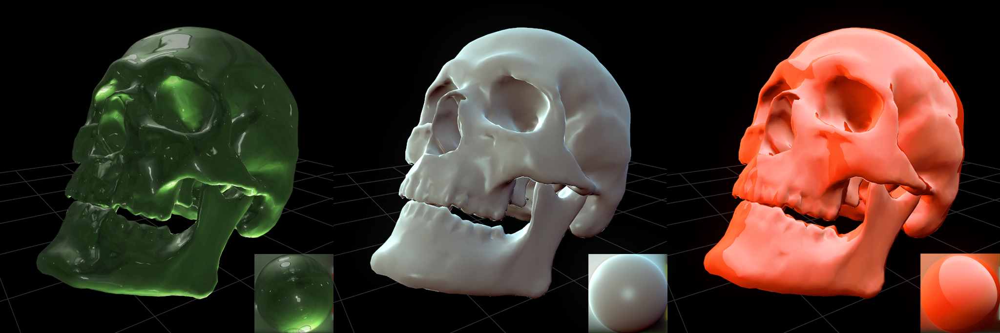

# CinderExperiments
Public repository of personal cinder projects, largely for my own edification.

## MatCapShaders

Adopted from [here](http://www.clicktorelease.com/blog/creating-spherical-environment-mapping-shader) for cinder 0.9.0, the four line fragment shader looks up a texture based on the reflected incidence ray. The texture represents combined diffuse and reflective lighting. It is by no means physically accurate and it is hard to combine with true lighting passes, but it's cheap to compute and popular as a display shader in modeling software like zbrush and 3dcoat.
